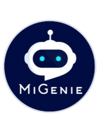

  

    <b>Welcome to MiGenie -  <i>The Doc Wizard!</i></b>.  
    I am an AI-powered solution for effortless information retrieval within your content repository. Powered by state-of-the-art GPT models, this innovative tool makes the process of finding answers to your project-related questions a breeze. No more slogging through tedious manual searches. Say farewell to those time-consuming hunts for information. With MiGenie, you can now swiftly access the knowledge you need, transforming your content experience.

### Supported LLMs and Vector Databases
**Supported LLMs:**
- [OpenAI](https://openai.com)
- [Azure OpenAI](https://azure.microsoft.com/en-us/products/ai-services/openai-service)
- [Anthropic ClaudeV2](https://www.anthropic.com/)
- [LM Studio (all models)](https://lmstudio.ai)

**Supported Vector Databases:**
- [LanceDB](https://github.com/lancedb/lancedb) (default)
- [Pinecone](https://pinecone.io)
- [Chroma](https://trychroma.com)
- [Weaviate](https://weaviate.io)
- [QDrant](https://qdrant.tech)

### Team Mitel
Contact Vikram Chugh and Ramabhadran

